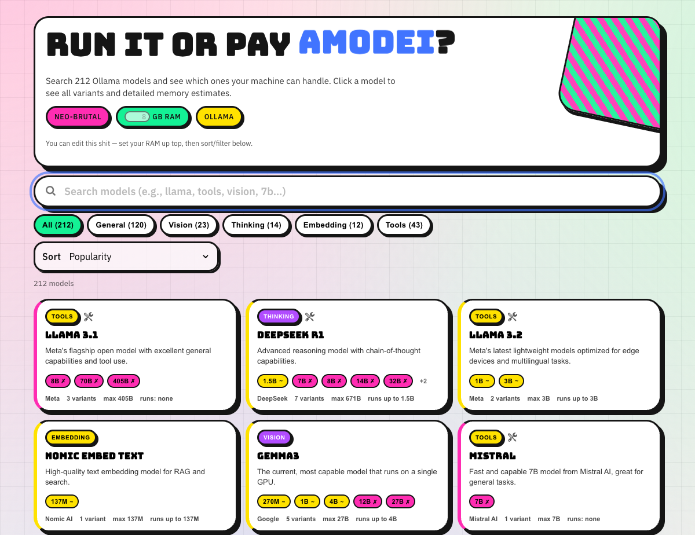
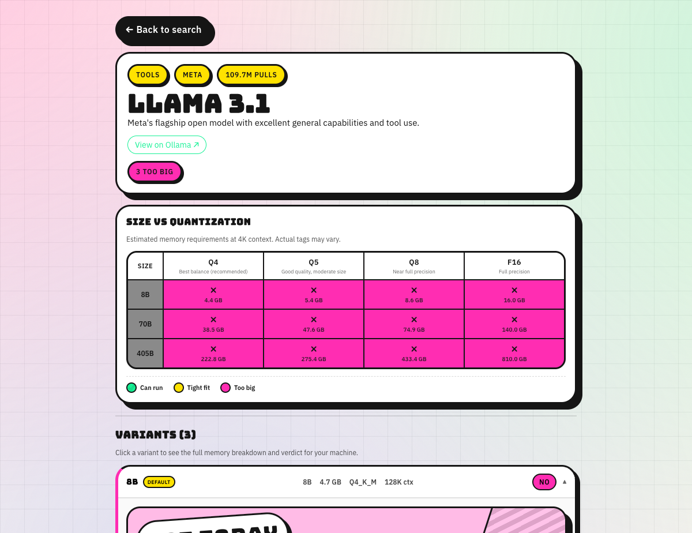

# Can I Run It? (Ollama Edition)

A **neo-brutalist** web app that helps you figure out which **Ollama models** your machine can run locally.



## Features

- **Search 200+ models** from the Ollama library
- **Instant verdicts** (Can run / Maybe / Too big) based on your RAM
- **Detailed variant view** with memory breakdowns for each model size and quantization
- **Test your local Ollama** installation right from the browser

### Model Detail View

Click any model to see all available variants with size vs quantization matrix:



### System Detection

The app detects your system specs via browser APIs:
- CPU threads (`navigator.hardwareConcurrency`)
- RAM (`navigator.deviceMemory` — Chromium only)
- GPU (WebGL renderer string)
- Manual RAM override for browsers that don't expose it

## Local Development

```bash
npm install
npm run dev
```

## Build

```bash
npm run build
npm run preview
```

Output goes to `dist/`.

## Deploy

Static SPA - works with any static host:
- **Build command**: `npm run build`
- **Output directory**: `dist`

## Ollama CORS

The "Test my Ollama" panel calls `http://localhost:11434`. Set `OLLAMA_ORIGINS` to include your origin:

```bash
export OLLAMA_ORIGINS="http://localhost:5173,https://your-domain.com"
ollama serve
```

## Tech Stack

- Vite + React + TypeScript
- Neo-brutalist CSS (no framework)
- Bungee + IBM Plex Sans fonts

## License

MIT
